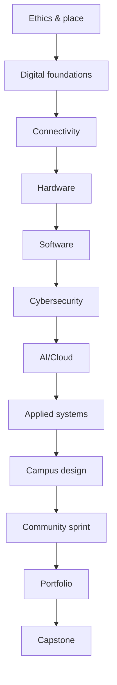

# WAIKE Gaza UPNOW: Learn, Repair, Rebuild — Course Map

```mermaid
flowchart TB
  W1[Ethics & place] --> W2[Digital foundations]
  W2 --> W3[Connectivity]
  W3 --> W4[Hardware]
  W4 --> W5[Software]
  W5 --> W6[Cybersecurity]
  W6 --> W7[AI/Cloud]
  W7 --> W8[Applied systems]
  W8 --> W9[Campus design]
  W9 --> W10[Community sprint]
  W10 --> W11[Portfolio]
  W11 --> W12[Capstone]
```
