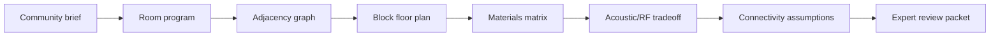

# 7GC Building Design System

> Conceptual only — not for construction. Requires licensed architect/engineer review before construction.

## Output types (allowed)

- Block diagrams, Mermaid diagrams, Markdown tables, YAML configs, JSON room graphs, SVG block floor plans

## Output types (not allowed)

- Stamped engineering drawings, final structural calculations, wind/snow/seismic/flood certifications, procurement-specific product recommendations

## Building typologies

Each site defines three typologies: pop-up/minimum pilot, retrofit/semi-permanent hub, full campus concept.

## Design workflow

