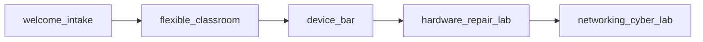

# WAIKE Ghana UPNOW — Floor Plan Program

> **Conceptual only — not for construction**
> Expert review required before construction or field deployment.
> Requires licensed architect/engineer review before construction.

## Block adjacency (conceptual)

## Three footprints

| Tier | Zones | Notes |
|------|-------|-------|
| Minimum pilot | 4 | Pop-up / remote-first where applicable |
| Semi-permanent hub | 8 | Retrofit typology |
| Full campus | 20 | Complete room program |

> Requires licensed architect/engineer review before construction.
