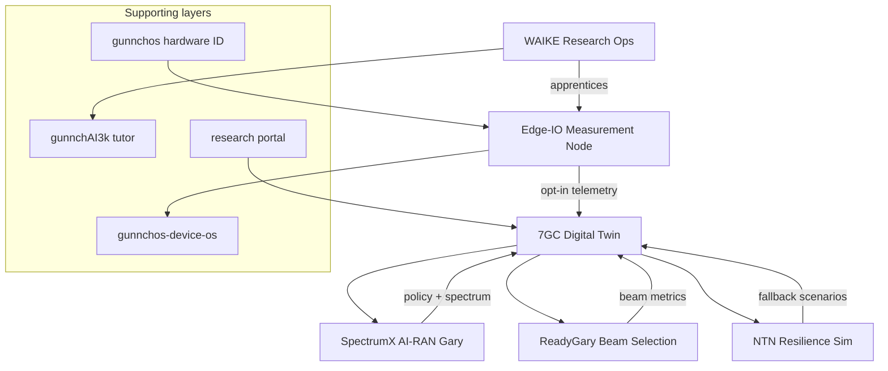

# Research Spine Diagram

```mermaid
flowchart TB
  WAIKE[WAIKE Research Ops]
  EDGE[Edge-IO Measurement Node]
  TWIN[7GC Digital Twin]
  SPX[SpectrumX AI-RAN Gary]
  RG[ReadyGary Beam Selection]
  NTN[NTN Resilience Sim]
  WAIKE -->|apprentices| EDGE
  EDGE -->|opt-in telemetry| TWIN
  TWIN --> SPX
  TWIN --> RG
  TWIN --> NTN
  SPX -->|policy + spectrum| TWIN
  RG -->|beam metrics| TWIN
  NTN -->|fallback scenarios| TWIN
  subgraph support [Supporting layers]
    GAI[gunnchAI3k tutor]
    DOS[gunnchos-device-os]
    HID[gunnchos hardware ID]
    PORT[research portal]
  end
  WAIKE --> GAI
  EDGE --> DOS
  HID --> EDGE
  PORT --> TWIN

```

Render: `npx @mermaid-js/mermaid-cli -i docs/diagrams/research_spine.mmd -o docs/diagrams/research_spine.svg`
