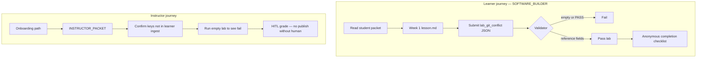

# Activity — current learner and instructor paths

```mermaid
flowchart TD
  subgraph learner [Learner journey — SOFTWARE_BUILDER]
    L1[Read student packet] --> L2[Week 1 lesson.md]
    L2 --> L3[Submit lab_git_conflict JSON]
    L3 --> L4{Validator}
    L4 -->|empty or PASS| L5[Fail]
    L4 -->|reference fields| L6[Pass lab]
    L6 --> L7[Anonymous completion checklist]
  end
  subgraph instructor [Instructor journey]
    I1[Onboarding path] --> I2[INSTRUCTOR_PACKET]
    I2 --> I3[Confirm keys not in learner ingest]
    I3 --> I4[Run empty lab to see fail]
    I4 --> I5[HITL grade — no publish without human]
  end
```

Automated: `tests/journeys/test_learner_journey.py`, `tests/journeys/test_instructor_journey.py`.
