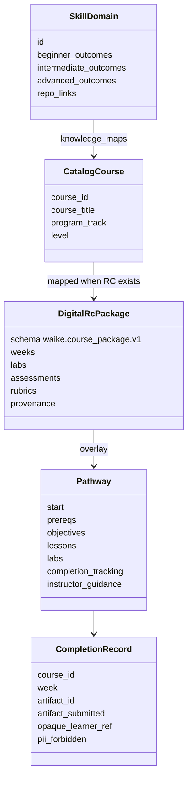

# Class — skill / knowledge (current)

File-backed types, not a learned knowledge graph.

Sources: `curriculum/catalog.yaml`, `schema/waike_course_package.v1.json`, `schema/waike_pathway.v1.json`, `knowledge_maps/waike_skill_tree.yaml`, `schema/waike_completion_tracking.v1.json`.
