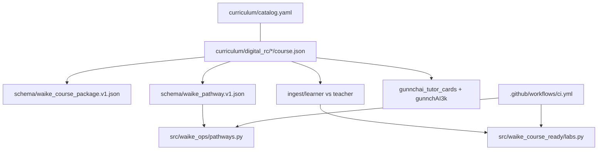

# Component — current

```mermaid
flowchart TB
  CAT[curriculum/catalog.yaml]
  RC[curriculum/digital_rc/*/course.json]
  SCH[schema/waike_course_package.v1.json]
  PATH[schema/waike_pathway.v1.json]
  ING[ingest/learner vs teacher]
  LABS[src/waike_course_ready/labs.py]
  OPS[src/waike_ops/pathways.py]
  GAI[gunnchai_tutor_cards + gunnchAI3k]
  CI[.github/workflows/ci.yml]
  CAT --- RC
  RC --> SCH
  RC --> PATH
  RC --> ING
  ING --> LABS
  PATH --> OPS
  RC --> GAI
  CI --> LABS
  CI --> OPS
```

Learner ingest is key-stripped. Teacher ingest holds `answer_keys`. gunnchAI3k consumes this repo via `WAIKE_REPO_ROOT` / sibling path.
