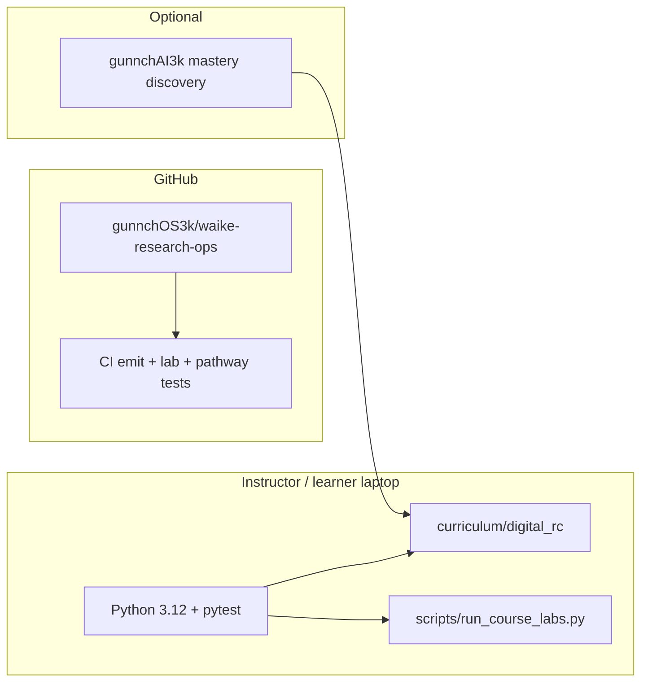

# Deployment — current

```mermaid
flowchart LR
  subgraph local [Instructor / learner laptop]
    PY[Python 3.12 + pytest]
    RC[curriculum/digital_rc]
    LAB[scripts/run_course_labs.py]
  end
  subgraph github [GitHub]
    REPO[gunnchOS3k/waike-research-ops]
    GHA[CI emit + lab + pathway tests]
  end
  subgraph sibling [Optional]
    AI[gunnchAI3k mastery discovery]
  end
  PY --> RC
  PY --> LAB
  REPO --> GHA
  AI --> RC
```

No LMS host, no gradebook, no production classroom SaaS. Partner/external program execution remains EXTERNAL_PENDING.
