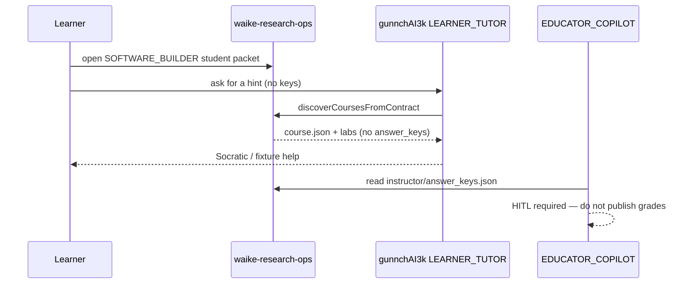

# Sequence — tutor interaction (current)

gunnchAI3k is a **consumer**. Live Discord lesson bodies in that repo are mocked; mastery discovery of `course.json` is real when the sibling checkout exists.

Contract: `docs/17_WAIKE_TO_GUNNCHAI3K_API_CONTRACT.md`, `docs/GUNNCHAI3K_TUTOR_INTEGRATION.md`. Modes enforced in gunnchAI3k `src/waike-mastery/modes.ts`.
