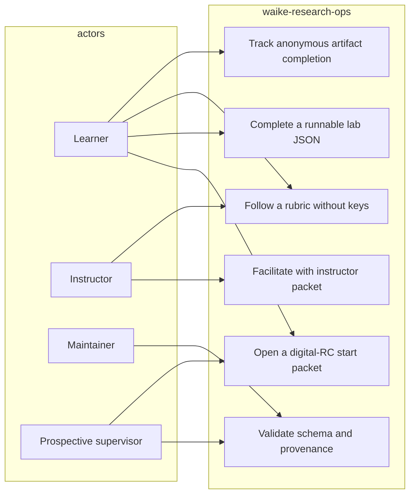

# Use case — current

Actors: learner, instructor, curriculum maintainer, prospective supervisor. WAIKE does not grant degrees or carrier certificates.

Counts: **14** `curriculum/digital_rc/*/course.json` packages (do not claim 18 for COURSE_DIGITAL_RC). Catalog YAML lists **18** course_ids as a separate universe.
